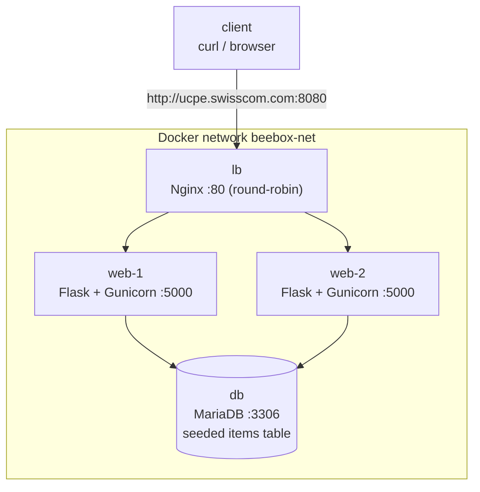

# BeeBox - Production-like System (IaC + Configuration Management + CI/CD)

A small, production-like system provisioned and configured entirely through code:

- **1 Load Balancer** (Nginx, round-robin)
- **2 Web Servers** (Flask + Gunicorn REST API)
- **1 SQL Database** (MariaDB, MySQL-compatible)

It demonstrates the three DevOps pillars end to end:


| Pillar                   | Tool                                  |
| ------------------------ | ------------------------------------- |
| Infrastructure as Code   | **Terraform** (local Docker provider) |
| Configuration Management | **Ansible**                           |
| CI/CD Automation         | **GitHub Actions**                    |


The load balancer answers at `http://ucpe.swisscom.com:8080`, and `GET /api/data`
returns rows from the database as JSON.

---

## Architecture



Each node is a **systemd-enabled container** launched by Terraform, so Ansible can
configure it like a real server (manage services, run `apt`, run `lynis`). Only the
load balancer's port is published to the host; the web and database nodes are
reachable only on the private `beebox-net` network and resolve each other by name.

### Request flow

1. A request hits Nginx on the published port (`8080` -> container `80`).
2. Nginx round-robins it to `web-1` or `web-2` (`proxy_pass` to the upstream pool).
3. The Flask app queries MariaDB and returns JSON, including a `served_by` field
  (the serving container's hostname) so load balancing is observable.

---

## Repository layout

```
.
├── app/                # REST API source (Flask + Gunicorn)
│   ├── app.py          #   routes: /api/data, /health, /
│   ├── db.py           #   PyMySQL access with connection retry
│   └── requirements.txt
├── terraform/          # IaC: network + 4 systemd containers
│   ├── versions.tf  variables.tf  main.tf  outputs.tf
│   └── terraform.tfvars.example
├── ansible/            # Configuration management
│   ├── ansible.cfg  inventory.ini  requirements.yml  playbook.yml
│   ├── group_vars/all.yml
│   └── roles/{common,database,webserver,loadbalancer,security}
├── scripts/            # setup-hosts.sh, smoke-test.sh
├── reports/            # lynis audit evidence (generated)
├── Makefile            # single entry point (make help)
└── .github/workflows/ci.yml   # CI/CD pipeline (GitHub Actions)
```

---

## Prerequisites

A Docker engine plus the standard IaC tooling on your machine (or on the CI runner):

- **Docker** — **Docker Desktop is recommended** (simplest: it provides the daemon
with no extra configuration). Colima, OrbStack, or native Linux Docker also work.
- **Terraform** >= 1.5
- **Ansible** (with `ansible-galaxy`)
- **Python 3** and **Make**

> **Docker endpoint (portability):** Terraform/Ansible talk to your local Docker
> daemon and no socket path is hardcoded. With **Docker Desktop** the default socket
> is used automatically — nothing to set. Only if you use a non-default engine do you
> need to export `DOCKER_HOST`, e.g. for Colima:
>
> ```bash
> export DOCKER_HOST="unix://$HOME/.colima/default/docker.sock"
> ```

---

## Setup steps

```bash
# 1. Resolve the load balancer hostname locally (adds 127.0.0.1 ucpe.swisscom.com)
make hosts

# 2. Provision the infrastructure (Terraform)
make up

# 3. Configure all servers (Ansible: DB, web, LB, security)
make configure

# 4. Test the load balancer endpoint
make test
```

Or run the whole flow at once:

```bash
make all      # up -> configure -> test
```

Tear everything down when finished:

```bash
make down
```

Run `make help` to see all targets.

---

## Example REST API query

```bash
curl http://ucpe.swisscom.com:8080/api/data
```

Sample response:

```json
{
  "served_by": "web-1",
  "count": 3,
  "data": [
    { "id": 1, "name": "alpha", "description": "First sample item",  "created_at": "2026-06-13T07:00:00" },
    { "id": 2, "name": "beta",  "description": "Second sample item", "created_at": "2026-06-13T07:00:00" },
    { "id": 3, "name": "gamma", "description": "Third sample item",  "created_at": "2026-06-13T07:00:00" }
  ]
}
```

### Demonstrating round-robin

Repeated requests alternate between the two web servers (see `served_by`):

```bash
for i in $(seq 1 4); do curl -s http://ucpe.swisscom.com:8080/api/data | grep -o '"served_by": *"[^"]*"'; done
# "served_by": "web-1"
# "served_by": "web-2"
# "served_by": "web-1"
# "served_by": "web-2"
```

`make test` automates this: it asserts HTTP 200, validates the JSON, and confirms
both backends respond.

A health endpoint is also available:

```bash
curl http://ucpe.swisscom.com:8080/health
# {"status": "ok", "served_by": "web-2", "database": "up"}
```

---

## Security / patching evidence

The Ansible `security` role runs on **every** host and:

1. Applies available system package updates (`apt upgrade`).
2. Installs and runs a **Lynis** system audit.
3. Saves each host's audit output to `reports/lynis-<host>.txt` as evidence.

After `make configure`, inspect the reports:

```bash
ls reports/
# lynis-db.txt  lynis-web-1.txt  lynis-web-2.txt  lynis-lb.txt

grep "Hardening index" reports/lynis-web-1.txt
```

In CI these reports are uploaded as **job artifacts** from the `configure` stage.

Additional security measures applied:

- The database application user is granted `**SELECT` only** (the API is read-only).
- The web service runs as a dedicated **non-root** user (`beebox`) under systemd.
- The environment file containing the DB password is mode `0640`.
- Only the load balancer port is exposed; DB and web nodes stay on the private network.

---

## CI/CD pipeline

`.github/workflows/ci.yml` runs the same Makefile targets used locally, so the
workflow is itself proof that the system provisions and works on a clean machine.
GitHub-hosted `ubuntu-latest` runners ship with Docker, so the systemd containers,
Terraform (Docker provider) and Ansible (Docker connection) all work directly.


| Job           | Action                                                                                                                              |
| ------------- | ----------------------------------------------------------------------------------------------------------------------------------- |
| `lint`        | `terraform fmt`/`validate`, `yamllint`, `flake8`, `ansible-lint`, shell syntax                                                      |
| `deploy-test` | `make up` (Terraform) -> `make configure` (Ansible) -> `make test` (curl the LB, assert JSON + round-robin) -> `make down` (always) |


Build, configure and test live in a **single job** so the containers persist across
steps (GitHub runs each job on a fresh VM). The lynis audit reports are uploaded as
a build artifact, and the smoke test targets the runner's published `localhost:8080`.

---

## Configuration reference


| Where                        | Variable                              | Default                                      |
| ---------------------------- | ------------------------------------- | -------------------------------------------- |
| `terraform/variables.tf`     | `lb_port`                             | `8080`                                       |
| `terraform/variables.tf`     | `web_replica_count`                   | `2`                                          |
| `terraform/variables.tf`     | `base_image`                          | `geerlingguy/docker-debian12-ansible@sha256:1f76107285118095a97e14673de67ee7a4372a840b35223cd0c1212fdd3cf5b3` |
| `ansible/group_vars/all.yml` | `db_name` / `db_user` / `db_password` | `beebox` / `beebox` / `beebox_pw`            |
| `ansible/group_vars/all.yml` | `app_port`                            | `5000`                                       |
| `ansible/group_vars/all.yml` | `lb_hostname`                         | `ucpe.swisscom.com`                          |


---

## Design notes

- **Why systemd containers:** the assignment asks for configuration management and
host-level security auditing across servers. Treating containers as disposable,
VM-like hosts lets Ansible manage real services and run `lynis` with no cloud cost.
In production the same Ansible code would target real VMs or cloud instances; only
the Terraform provider would change.
- **Why MariaDB:** it is the MySQL-compatible database shipped with Debian, installs
cleanly, and works with `PyMySQL` over the MySQL wire protocol with no auth-plugin
friction.
- **Credentials** are kept in `ansible/group_vars/all.yml` for this prototype; in
production they would live in Ansible Vault or a secrets manager.

---
## Production hardening / future improvements

This prototype is intentionally scoped to demonstrate the IaC + configuration
management + CI/CD loop on a single machine. The two trade-offs below are
deliberate for the demo and would be addressed before running this stack in
production:

- **Privileged containers.** Each node runs `systemd` as PID 1 with
  `privileged = true` and a host cgroup mount so Ansible can manage it like a
  real server. In production the same Ansible roles would target real VMs or
  cloud instances and `privileged` would not be needed — only the Terraform
  provider would change.
- **Secrets in plaintext.** Database credentials live in
  `ansible/group_vars/all.yml` for readability. In production they would be
  encrypted with **Ansible Vault**, with the vault password supplied to CI via
  an encrypted GitHub Actions secret. A real secrets manager (HashiCorp Vault,
  AWS Secrets Manager, Azure Key Vault) would be the next step.

Other natural improvements, out of scope for this assignment:

- **TLS** at the load balancer (Let's Encrypt or a corporate CA).
- **High availability** for the LB (active/passive with `keepalived`, or a
  managed cloud LB).
- **Backups** for the database (nightly `mysqldump` + binlog retention for PITR).
- **Observability** — Prometheus metrics + central structured logging.
- **Image vulnerability scanning** (Trivy/Grype) on every CI run — complements Lynis: Lynis audits configuration of the running system, **Trivy/Grype** audits known CVEs in the packages inside the pinned base image and in the Python dependencies.
- **Dynamic Ansible inventory** generated from `terraform output -json` for
  scaling beyond two web servers.

---

## Testing & verification

The system is verified two complementary ways:

1. **Automated (CI):** every push runs the GitHub Actions pipeline, which provisions
  the stack, configures it, and runs the smoke test — asserting `GET /api/data`
   returns HTTP 200 + valid JSON and that round-robin alternates between `web-1`
   and `web-2`.
2. **Interactive (manual):** the endpoints were exercised with `curl` and Postman:
  - `GET /api/data` -> seeded rows as JSON, with `served_by` identifying the backend
  - `GET /health` -> status + serving host
  - repeated calls alternate `web-1` / `web-2`, confirming load balancing

### Example requests (Postman)

`GET /api/data` returns the seeded rows as JSON, with `served_by` showing which web
server answered:

GET /api/data returns JSON from the database, served by web-1

Round-robin in action - two consecutive `GET /health` calls are answered by
different backends (`web-1` then `web-2`):

GET /health served by web-1
The next request served by web-2

### Note on the testing environment

Local end-to-end testing was performed on a **personal machine running Docker
Desktop**. The corporate environment enforces TLS interception via a security
proxy/CA, which blocks direct Docker Hub image pulls; rather than weaken that
control locally, a clean machine without those restrictions was used for the
interactive run. The **GitHub Actions pipeline provides the environment-independent
verification**, reproducing the full provision -> configure -> test flow on every push.