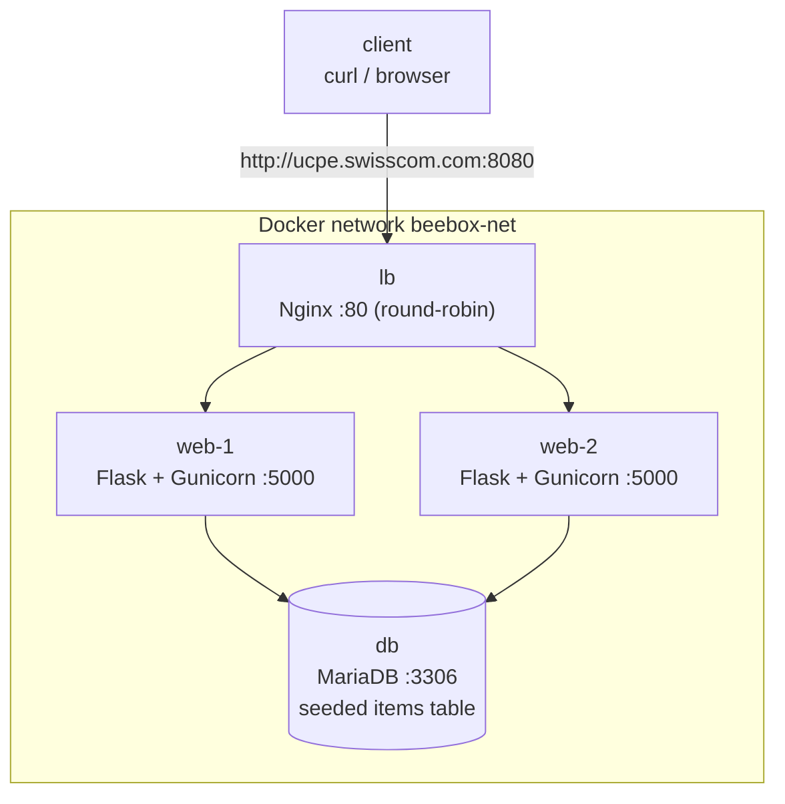

# BeeBox - Production-like System (IaC + Configuration Management + CI/CD)

A small, production-like system provisioned and configured entirely through code:

- **1 Load Balancer** (Nginx, round-robin)
- **2 Web Servers** (Flask + Gunicorn REST API)
- **1 SQL Database** (MariaDB, MySQL-compatible)

It demonstrates the three DevOps pillars end to end:

| Pillar | Tool |
|---|---|
| Infrastructure as Code | **Terraform** (local Docker provider) |
| Configuration Management | **Ansible** |
| CI/CD Automation | **GitLab CI** |

The load balancer answers at `http://ucpe.swisscom.com:8080`, and `GET /api/data`
returns rows from the database as JSON.

---

## Architecture



Each node is a **systemd-enabled container** launched by Terraform, so Ansible can
configure it like a real server (manage services, run `apt`, run `lynis`). Only the
load balancer's port is published to the host; the web and database nodes are
reachable only on the private `beebox-net` network and resolve each other by name.

### Request flow

1. A request hits Nginx on the published port (`8080` -> container `80`).
2. Nginx round-robins it to `web-1` or `web-2` (`proxy_pass` to the upstream pool).
3. The Flask app queries MariaDB and returns JSON, including a `served_by` field
   (the serving container's hostname) so load balancing is observable.

---

## Repository layout

```
.
├── app/                # REST API source (Flask + Gunicorn)
│   ├── app.py          #   routes: /api/data, /health, /
│   ├── db.py           #   PyMySQL access with connection retry
│   └── requirements.txt
├── terraform/          # IaC: network + 4 systemd containers
│   ├── versions.tf  variables.tf  main.tf  outputs.tf
│   └── terraform.tfvars.example
├── ansible/            # Configuration management
│   ├── ansible.cfg  inventory.ini  requirements.yml  playbook.yml
│   ├── group_vars/all.yml
│   └── roles/{common,database,webserver,loadbalancer,security}
├── scripts/            # setup-hosts.sh, smoke-test.sh
├── reports/            # lynis audit evidence (generated)
├── Makefile            # single entry point (make help)
└── .gitlab-ci.yml      # CI/CD pipeline
```

---

## Prerequisites

A Docker engine plus the standard IaC tooling on your machine (or on the CI runner):

- **Docker** (Docker Desktop, **Colima**, OrbStack, or native Linux Docker)
- **Terraform** >= 1.5
- **Ansible** (with `ansible-galaxy`)
- **Python 3** and **Make**

> **Docker endpoint (portability):** Terraform/Ansible talk to your local Docker
> daemon and no socket path is hardcoded. If you are not using the default context,
> export `DOCKER_HOST`. For Colima:
> ```bash
> export DOCKER_HOST="unix://$HOME/.colima/default/docker.sock"
> ```

---

## Setup steps

```bash
# 1. Resolve the load balancer hostname locally (adds 127.0.0.1 ucpe.swisscom.com)
make hosts

# 2. Provision the infrastructure (Terraform)
make up

# 3. Configure all servers (Ansible: DB, web, LB, security)
make configure

# 4. Test the load balancer endpoint
make test
```

Or run the whole flow at once:

```bash
make all      # up -> configure -> test
```

Tear everything down when finished:

```bash
make down
```

Run `make help` to see all targets.

---

## Example REST API query

```bash
curl http://ucpe.swisscom.com:8080/api/data
```

Sample response:

```json
{
  "served_by": "web-1",
  "count": 3,
  "data": [
    { "id": 1, "name": "alpha", "description": "First sample item",  "created_at": "2026-06-13T07:00:00" },
    { "id": 2, "name": "beta",  "description": "Second sample item", "created_at": "2026-06-13T07:00:00" },
    { "id": 3, "name": "gamma", "description": "Third sample item",  "created_at": "2026-06-13T07:00:00" }
  ]
}
```

### Demonstrating round-robin

Repeated requests alternate between the two web servers (see `served_by`):

```bash
for i in $(seq 1 4); do curl -s http://ucpe.swisscom.com:8080/api/data | grep -o '"served_by": *"[^"]*"'; done
# "served_by": "web-1"
# "served_by": "web-2"
# "served_by": "web-1"
# "served_by": "web-2"
```

`make test` automates this: it asserts HTTP 200, validates the JSON, and confirms
both backends respond.

A health endpoint is also available:

```bash
curl http://ucpe.swisscom.com:8080/health
# {"status": "ok", "served_by": "web-2", "database": "up"}
```

---

## Security / patching evidence

The Ansible `security` role runs on **every** host and:

1. Applies available system package updates (`apt upgrade`).
2. Installs and runs a **Lynis** system audit.
3. Saves each host's audit output to `reports/lynis-<host>.txt` as evidence.

After `make configure`, inspect the reports:

```bash
ls reports/
# lynis-db.txt  lynis-web-1.txt  lynis-web-2.txt  lynis-lb.txt

grep "Hardening index" reports/lynis-web-1.txt
```

In CI these reports are uploaded as **job artifacts** from the `configure` stage.

Additional security measures applied:

- The database application user is granted **`SELECT` only** (the API is read-only).
- The web service runs as a dedicated **non-root** user (`beebox`) under systemd.
- The environment file containing the DB password is mode `0640`.
- Only the load balancer port is exposed; DB and web nodes stay on the private network.

---

## CI/CD pipeline

`.gitlab-ci.yml` runs the same Makefile targets used locally, so the pipeline is
itself proof that the system provisions and works on a clean machine:

| Stage | Action |
|---|---|
| `lint` | `terraform fmt`/`validate`, `yamllint`, `flake8`, `ansible-lint`, shell syntax |
| `build` | `make up` (Terraform apply) |
| `configure` | `make configure` (Ansible) |
| `test` | `make test` (curl the LB, assert JSON + round-robin) |
| `cleanup` | `terraform destroy` (always runs) |

**Runner requirements:** a self-hosted GitLab runner using the **shell executor** on
a Linux host that has Docker, Terraform, Ansible, Python 3 and Make installed.
(In CI the smoke test targets the runner's published `localhost:8080`.)

---

## Configuration reference

| Where | Variable | Default |
|---|---|---|
| `terraform/variables.tf` | `lb_port` | `8080` |
| `terraform/variables.tf` | `web_replica_count` | `2` |
| `terraform/variables.tf` | `base_image` | `geerlingguy/docker-debian12-ansible:latest` |
| `ansible/group_vars/all.yml` | `db_name` / `db_user` / `db_password` | `beebox` / `beebox` / `beebox_pw` |
| `ansible/group_vars/all.yml` | `app_port` | `5000` |
| `ansible/group_vars/all.yml` | `lb_hostname` | `ucpe.swisscom.com` |

---

## Design notes

- **Why systemd containers:** the assignment asks for configuration management and
  host-level security auditing across servers. Treating containers as disposable,
  VM-like hosts lets Ansible manage real services and run `lynis` with no cloud cost.
  In production the same Ansible code would target real VMs or cloud instances; only
  the Terraform provider would change.
- **Why MariaDB:** it is the MySQL-compatible database shipped with Debian, installs
  cleanly, and works with `PyMySQL` over the MySQL wire protocol with no auth-plugin
  friction.
- **Credentials** are kept in `ansible/group_vars/all.yml` for this prototype; in
  production they would live in Ansible Vault or a secrets manager.

